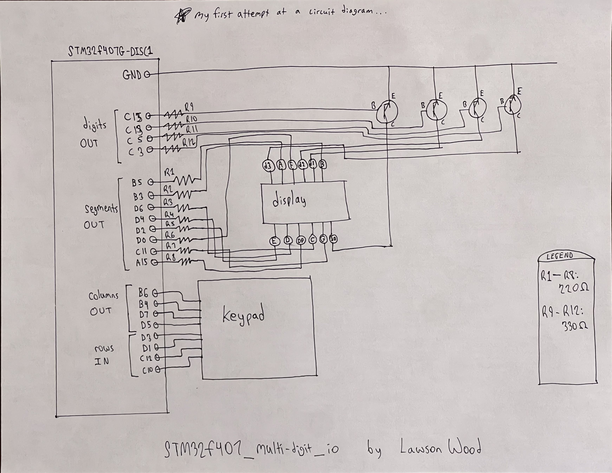
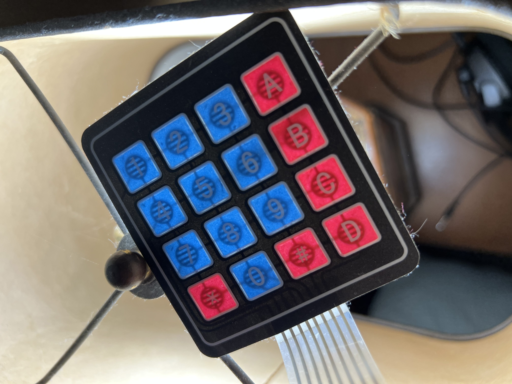

# Multi-digit IO (bare-metal) using a 4x4 matrix keypad, 4-digit segmented display, and an STM32f407

Credit to [cpq](https://github.com/cpq) and his [bare-metal programming guide](https://github.com/cpq/bare-metal-programming-guide) for getting me started with bare-metal programming. This guide introduced me to basic HAL structure, linker scripts, startup code, and syscalls. Much of the foundation of my project comes from this guide.

## Video demo
This [video demonstration](https://www.youtube.com/watch?v=RH00t6PczsE) is a compilation of clips from the start of my project (with a single digit display) progressing as I add keypad input, experiment with transistors, and ultimately finish the project

## Images
A rough sketch of a circuit diagram (my first time attempting one), showing how the MCU pins connect to the keypad, display, and transistors:

When you place a bright light behind the keypad, the internal wiring becomes visible - enabling you to determine which pin corresponds to which row/column:

## Concepts
#### Regarding the primary goal of the project:
- I learned about single-digit segmented displays, that each segment is just an LED activated by its corresponding pin.

- I learned about 4x4 matrix keypads, that each of the 8 pins correspond to one row or column. To scan for input, you send a HIGH signal to one columnn at a time. For each column, scan each row to check for input. If a button is pressed, it will complete a circuit between that column and row, so the corresponding row pin will read a HIGH signal.

- I learned about transistors (NPN) and how to use them as a switch controlled by an electric signal.

- I learned about multi-digit segmented displays, which have 8 pins corresponding to each segment (including the decimal point) and 4 ground pins (one for each digit). To choose which digit to display at a given time, a transistor can be switched ON for that digit's ground pin.

#### Additional concepts (building the foundation):
- I learned much about bare-metal programming and setup (using the aforementioned guide) to build this project without a special IDE or any hardware abstraction code libraries.

- On top of learning to build a linker script, startup code, and redefine system calls, I learned about utilizing various functions and peripherals of microcontrollers, such as:
    - GPIO
    - SysTick
    - UART (for printing output)
    - RCC
    - An API (HAL.h) was developed for working with all of these (with help from the guide mentioned above)

- I learned to use PuTTY to listen on my computer's COM port so I could receive output from the MCU (via printf and a USB connection)

- I used various command line tools for building and flashing the project to the MCU. These commands were added to a Makefile to simpify the process.